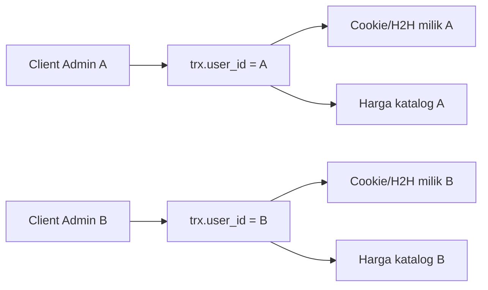

# Isolasi per admin

Gateway mendukung **banyak admin**. Data koneksi dan katalog tidak boleh saling dipakai antar admin.

## Ringkasan

## Aturan

1. **API key** terikat `users` / `api_keys.user_id` → menjadi `transactions.user_id`.
2. **Harga & SKU** dibaca dari produk dengan `owner_user_id` = pemilik (clone dari master saat member dibuat).
3. **Cookie** disimpan di `settings` dengan `user_id` admin; upload tanpa `userId` ditolak.
4. **H2H** (`connection_mode`, base URL, partner, secret) per `user_id`.
5. **Async process** memanggil `getUpstreamAdapter(userId)` dan, di mode cookie, menolak jika admin belum punya cookie sendiri.
6. **Dashboard**: admin tidak melihat transaksi admin lain; Super Admin melihat semua.

## Migrasi penting

| File | Fungsi |
|------|--------|
| `026_member_connection_otomax.sql` | `connection_type`, kredensial OtoMax |
| `027_products_owner_user_id.sql` | katalog per admin |
| `028_users_default_cb_url.sql` | callback default |
| `029_fix_settings_uk_user_key.sql` | `UNIQUE (user_id, key)` — wajib agar cookie/H2H tidak menimpa baris global |

!!! warning "Production"
    Pastikan indeks `uk_user_key` ada di tabel `settings` (bukan hanya `uk_key` pada kolom `key`). Tanpa itu, simpan settings per-user bisa menimpa data global.

## Operasional

- Tiap admin mengisi **Koneksi** sendiri (Cookie atau H2H).
- Tiap admin mengatur **Account Settings** (API/OtoMax, IP, callback).
- Rate-limit *sensitive ops* membatasi ganti connection/callback beruntun (~10 / 5 menit / IP) — ini proteksi, bukan bug isolasi.
