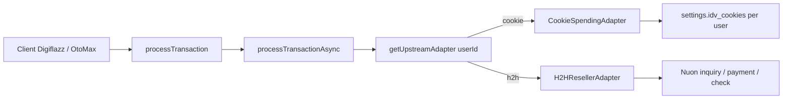
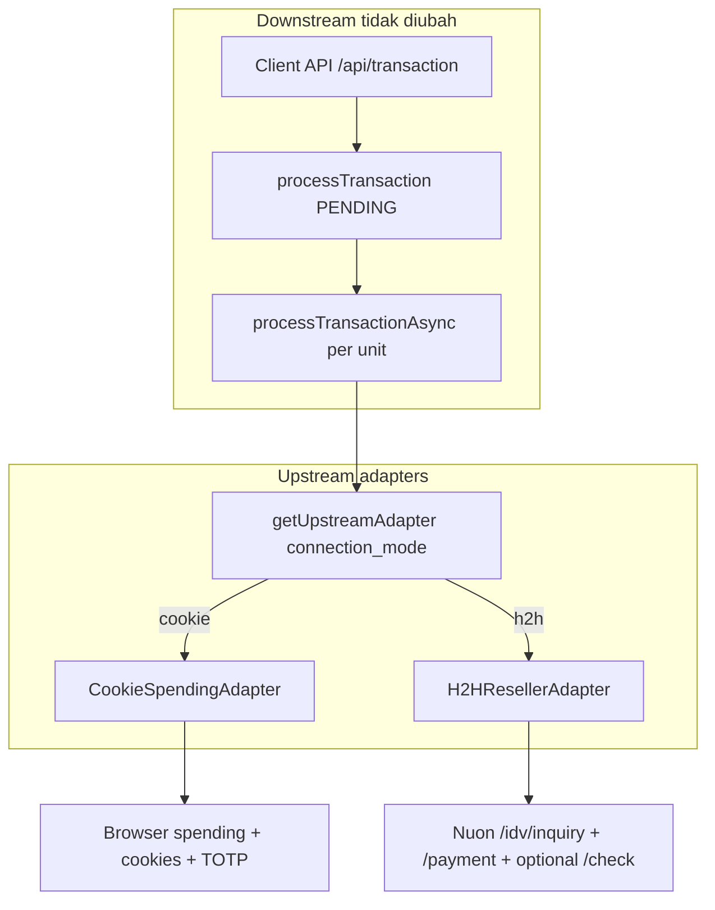
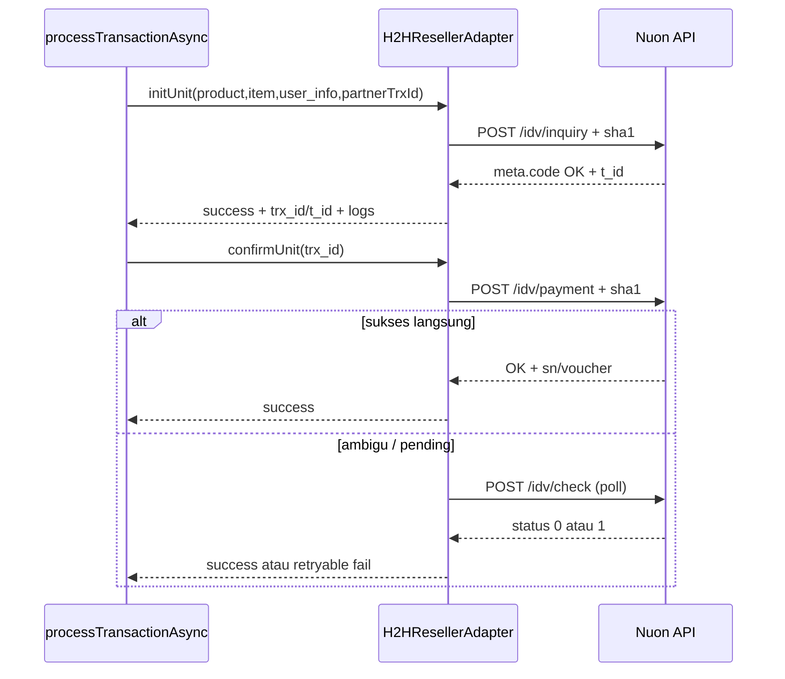

# Upstream H2H Architecture

Dokumen ini merangkum kontrak **Upoint / Nuon IDV H2H API for Reseller v1.1** dan arsitektur gateway untuk memilih upstream **cookie** (browser) vs **H2H** (API reseller resmi).

**Status:** adapter H2H sudah terpasang di path transaksi. Mode dipilih per admin (`connection_mode` di settings `user_id`); factory `getUpstreamAdapter(userId)` dipakai di `processTransactionAsync`.

Sumber kontrak: `Upoint IDV H2H API FOR RESELLER V1 new (3).docx` (PT Nuon Digital Indonesia).

Irisan multi-admin: [Isolasi per admin](per-admin.md).

---

## 1. Kontrak Nuon H2H (ringkasan)

Upstream resmi reseller. Base URL = placeholder `[url]` dari Nuon. Auth: `partner_id` + `secret_token` (SHA1). Content-Type: `application/json`.

### 1.1 Endpoint

| Endpoint | Peran | Analog cookie hari ini |
|----------|-------|-------------------------|
| `POST /idv/inquiry` | Init spending (product, item, user_info) | `POST /api/postSpendingInit` |
| `POST /idv/payment` | Confirm spending (`trx_id`) | `POST /api/postSpendingConfirm` (+ TOTP) |
| `POST /idv/check` | Cek status (`status` 1=success, 0=pending) | Belum setara 1:1 |
| `POST /idv/redeem` | Redeem voucher → saldo IDV | Alur terpisah (bukan unit topup game) |

### 1.2 Signature (byte-exact)

| API | Formula |
|-----|---------|
| Inquiry | `sha1(trx_id + secret_token + idv_user_id)` |
| Payment | `sha1(trx_id + secret_token)` |
| Check | `sha1(trx_id + secret_token)` |
| Redeem | `sha1(voucher_code + idv_user_id + secret_token)` |

Catatan dokumen: contoh redeem menyebut `trx_id` di teks signature, tetapi parameter body memakai `voucher_code`. Implementasi harus mengikuti **parameter body + rumus tabel** (`voucher_code + idv_user_id + secret_token`), dan diverifikasi lagi di sandbox Nuon.

### 1.3 Inquiry — body

| Field | Wajib | Keterangan |
|-------|-------|------------|
| `partner_id` | Ya | Integer partner |
| `trx_id` | Ya | Unique partner transaction id |
| `product` | Ya | Product code (mis. `free_fire`) |
| `item` | Ya | Item code (mis. `freefire_5`) |
| `user_info` | Ya | **JSON string** (stringified object) |
| `user_info.idv_user_id` | Ya | IDV user reseller |
| `user_info.user_id` | Ya | Game user id |
| `user_info.user_ip` | Kondisional | Free Fire, AoV, CoD, Speed Drifters, Undawn |
| `user_info.zone_id` | Kondisional | Mobile Legends |
| `signature` | Ya | SHA1 di atas |

Response sukses (`meta.code = OK`): `data.t_id`, `data.trx_id`, `data.info` (product/item/amount/user_info/time/details incl. `packed_role_id`, `server_name`, `role_name`).

### 1.4 Payment — body

| Field | Wajib |
|-------|-------|
| `partner_id` | Ya |
| `trx_id` | Ya (sama dengan inquiry) |
| `signature` | Ya |

Response: `t_id`, `trx_id`, `product`, `item`; dokumen juga menyebut `voucher` / `sn` di skema response (contoh JSON ringkas mungkin tidak selalu mengisi keduanya — map defensif).

### 1.5 Check status — body

Sama shape dengan payment (`partner_id`, `trx_id`, `signature`).

Response `data.status`: `1` = success, `0` = pending. Field lain: `product`, `item`, `amount`, `trx_created`, `idv_user_id` / `upoint_user_id` (dokumen campur nama).

### 1.6 Redeem voucher — body

| Field | Wajib |
|-------|-------|
| `partner_id` | Ya |
| `voucher_code` | Ya |
| `idv_user_id` | Ya |
| `signature` | Ya |

Response: `amount`, `balance`, `voucher_trx_id`, `time`. **Bukan** bagian loop unit transaksi game.

### 1.7 Error codes (matrix)

| Code | Inquiry / Payment / Redeem | Arti desain gateway |
|------|----------------------------|---------------------|
| `OK` | Sukses | Terminal success |
| `E001` | Missing parameter | Client/config error — jangan retry buta |
| `E002` | Invalid parameter / invalid trx (check) | Validasi / mapping salah |
| `E004` | Unauthenticated | Secret/partner salah — `isAuthError` |
| `E008` | IP unauthenticated | IP server belum di-whitelist Nuon — `isAuthError` / ops |
| `E009` | Server error | `isRetryable` (terbatas) |
| `E010` | Transaction not found (inquiry list) | Trx id salah |
| `E011` | Invalid voucher / transaction invalid | Business fail |
| `E012` | Voucher used / **not enough credit** | `isInsufficientBalance` (spending) |
| `E013` | User rate limit / blocked | Jangan spam retry |
| `E100` | Maintenance | `isRetryable` dengan backoff |

Ini **bukan** semantik cookie (`TOKEN_EXPIRED` / HTTP `440` / HTML login page).

---

## 2. Kondisi kode saat ini



| Area | Lokasi | Status |
|------|--------|--------|
| Queue + unit loop | `transaction.service.js` → `getUpstreamAdapter(userId)` | **Aktif** — cookie atau H2H per owner |
| Cookie adapter | `cookieSpending.adapter.js` + `idvSpending.service.js` | Cookie + TOTP |
| H2H adapter | `h2hReseller.adapter.js` | Inquiry / payment / check / redeem |
| Cookie store | `idvCookieStore.util.js` | Wajib `userId` |
| H2H config | `idvH2hConfig.service.js` | Settings scoped `user_id` |
| UI Koneksi | `Connection.tsx` / form H2H | Mode + kredensial per admin |

**Naming trap:** “H2H” di `priceList.service.js` / `productDetail.service.js` = Open API untuk **client** gateway, bukan upstream Nuon.

---

## 3. Desain target: Upstream Adapter

### 3.1 Diagram



### 3.2 Sequence H2H per unit



### 3.3 Interface (spesifikasi)

Lokasi usulan (implementasi nanti): `backend/services/upstream/` 

```js
// Spesifikasi — bukan file production wajib di fase ini
/**
 * @typedef {Object} UpstreamUnitInitPayload
 * @property {string} partnerTrxId   // unik per unit (ref_id + unit_index)
 * @property {string} product        // kode Nuon / mapped
 * @property {string} item
 * @property {string} customerNo     // game user_id
 * @property {string} [userIp]
 * @property {string} [zoneId]
 * @property {object} [rawDetail]    // row unit/detail untuk adapter cookie
 */

/**
 * @typedef {Object} UpstreamUnitResult
 * @property {boolean} success
 * @property {object} [data]         // trx_id, t_id, amount, sn, voucher, ...
 * @property {string} [message]
 * @property {boolean} [isAuthError]
 * @property {boolean} [isInsufficientBalance]
 * @property {boolean} [isRetryable]
 * @property {boolean} [isTokenExpired] // hanya meaningful utk cookie adapter (legacy)
 * @property {object} [request_log]
 * @property {object} [response_log]
 * @property {object} [diagnostics]
 */

/**
 * UpstreamAdapter
 * - initUnit(payload) -> UpstreamUnitResult
 * - confirmUnit({ partnerTrxId, initData, ... }) -> UpstreamUnitResult
 * - checkUnit({ partnerTrxId }) -> UpstreamUnitResult  // optional; no-op / unsupported di cookie
 */
```

**CookieSpendingAdapter:** wrap `IDVSpendingService.initSpending` / `confirmSpending`; map `isTokenExpired` / `isLoginTimeExpired` ke taxonomy di atas.

**H2HResellerAdapter:** HTTP client axios/fetch ke `h2h_base_url`; bangun signature; stringify `user_info`; map `meta.code` → flags.

**Factory:** `getUpstreamAdapter()` baca `connection_mode` dari settings (fallback env); default `cookie` agar perilaku production tidak berubah sampai admin switch.

### 3.4 Titik integrasi queue

Di `processTransactionAsync`, ganti pemanggilan langsung:

```text
IDVSpendingService.initSpending(...)
IDVSpendingService.confirmSpending(...)
```

menjadi:

```text
const adapter = await getUpstreamAdapter();
adapter.initUnit(...)
adapter.confirmUnit(...)
// optional: adapter.checkUnit(...) bila confirm ambigu
```

**Jangan** masukkan H2H ke `IDVGatewayService.ensureAuthenticated` / cookie jar — itu lifecycle browser saja.

---

## 4. Mapping field cookie ↔ H2H

| Gateway (hari ini) | H2H Nuon | Catatan |
|--------------------|----------|---------|
| Catalog `product` / `item_code` / `idv_item_code` | `product`, `item` | Validasi 1:1; jika beda → tabel/kolom mapping |
| `customer_no` | `user_info.user_id` | Game account |
| — | `user_info.user_ip` | Wajib game tertentu; sumber: config / request client / server egress IP policy |
| — | `user_info.zone_id` | MLBB |
| Cookie session user | `user_info.idv_user_id` | Dari config `h2h_idv_user_id`, bukan cookie |
| Internal unit id / ref | Partner `trx_id` | Disarankan: `{ref_id}-{unit_index}` atau UUID tersimpan di `transaction_units` |
| Init `trx_id` / `t_id` IDV browser | `t_id` Nuon | Simpan di log + kolom unit existing bila ada |
| Confirm SN / voucher | `sn` / `voucher` / payment data | Defensive map ke SN aggregator |
| TOTP `IDV_OTP_SECRET` | — | Tidak dipakai H2H |
| `idv_cookies` | — | Tidak dipakai H2H |

---

## 5. Config / settings (desain data)

Global satu mode aktif (cocok UI Koneksi):

| Key | Tipe | Keterangan |
|-----|------|------------|
| `connection_mode` | string | `cookie` \| `h2h` (default `cookie`) |
| `h2h_base_url` | string | Origin Nuon tanpa trailing slash |
| `h2h_partner_id` | int/string | Partner ID |
| `h2h_secret_token` | secret | Disimpan di `settings` (masked di API GET) |
| `h2h_idv_user_id` | string | IDV user untuk `user_info` / redeem |
| `h2h_default_user_ip` | string optional | Fallback jika game wajib IP |

**API dashboard:**

| Method | Path | Fungsi |
|--------|------|--------|
| `GET` | `/api/idv/h2h/config` | Baca config (secret masked) + `connection_mode` |
| `PUT` | `/api/idv/h2h/config` | Simpan kredensial + optional `activate_mode` |
| `PUT` | `/api/idv/h2h/connection-mode` | Set kunci mode saja `{ "mode": "cookie" \| "h2h" }` |
| `POST` | `/api/idv/h2h/redeem` | Redeem voucher Nuon (`/idv/redeem`) |

UAT lokal (mock Nuon, tidak hit production):

```bash
cd backend && npm run uat:upstream-h2h
```

**UI:**
- Halaman **Koneksi** — pemilih mode (dua kartu radio + **Simpan mode**); kunci = `settings.connection_mode`
- Halaman **Koneksi H2H** — form kredensial Nuon + test inquiry

> Catatan: kunci mode dipilih di halaman **Koneksi** (`PUT /api/idv/h2h/connection-mode`).  
> Antrian `processTransactionAsync` memakai `getUpstreamAdapter()` → cookie spending atau Nuon inquiry/payment sesuai `connection_mode`.

---

## 6. Gap analysis & UI

| Gap | Detail |
|-----|--------|
| Tidak ada factory/adapter | Queue hard-wire spending |
| Tidak ada persist mode | `Connection.tsx` hanya `navigate()` |
| H2H UI stub | Form credentials + test inquiry belum ada |
| Product/item mapping | Katalog internal mungkin ≠ kode Nuon |
| `user_ip` / `zone_id` | Belum ada di payload spending cookie |
| Error taxonomy | Retry/TOKEN_EXPIRED cookie-centric |
| Multi-unit partial | Policy cookie session-expiry oriented |
| IP whitelist Nuon | Ops: egress IP server harus didaftarkan |
| Redeem | Tidak ada use-case/admin flow |
| Logging | Perlu tag `upstream_mode=cookie\|h2h` di log agar debug jelas |

**UI (fase implementasi berikutnya):**

1. ~~`H2HConnection.tsx` — form base URL, partner id, secret, idv_user_id, tombol “Test inquiry”~~ **sudah**
2. Wire `H2HResellerAdapter` ke `processTransactionAsync` saat `connection_mode=h2h`
3. Indicator global mode aktif di header (opsional)

---

## 7. Non-goals (fase riset + desain ini)

- Tidak mengubah production transaction path.
- Tidak rebuild Docker / migration DB di fase ini.
- Tidak implementasi penuh `H2HResellerAdapter` atau UI credentials.
- Tidak menggabungkan redeem ke loop topup game.

---

## 8. Risiko

1. **E008 IP whitelist** — beda total dari cookie/WAF Cloudflare.
2. **Signature** harus concat exact; salah urutan = `E004`.
3. **`user_info` stringified JSON** — double-encode mudah terjadi.
4. **Mapping product/item** salah → `E002` / gagal bisnis.
5. **Pending/retry H2H** ≠ `TOKEN_EXPIRED` cookie — jangan reuse tombol “Proses Ulang” tanpa cabang mode.
6. **Redeem ≠ spending** — jangan satu tombol tanpa penjelasan.
7. **UI/backend drift** — pilih kartu H2H tanpa persist mode = traffic tetap cookie.

---

## 9. Backlog implementasi (fase berikutnya)

Urutan disarankan:

1. Migration/settings keys + baca di `config` / settings service; default `cookie`.
2. UI `H2HConnection` + API simpan/test credentials; persist `connection_mode`.
3. Skeleton `UpstreamAdapter` + `CookieSpendingAdapter` (wrap existing) + factory; wire queue tanpa ubah perilaku default.
4. `H2HResellerAdapter` (inquiry → payment → check); unit tests signature + mock Nuon.
5. Mapping product/item + `user_ip`/`zone_id` policy.
6. Error taxonomy + penyesuaian retry UI.
7. UAT sandbox Nuon (IP whitelist).
8. (Opsional) Redeem voucher admin flow terpisah.
9. Docs API operasional + update `features.md` / `configuration.md`.

---

## 10. Referensi file

| File | Peran |
|------|--------|
| `backend/services/transaction.service.js` | Titik ganti init/confirm |
| `backend/services/idv/idvSpending.service.js` | Cookie adapter source |
| `backend/utils/idvCookieStore.util.js` | Cookie settings |
| `dashboard.idv/src/pages/Connection.tsx` | Chooser UI |
| `dashboard.idv/src/pages/H2HConnection.tsx` | Stub H2H |
| Dokumen Nuon `.docx` di root project | Kontrak resmi |
